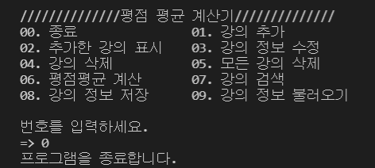
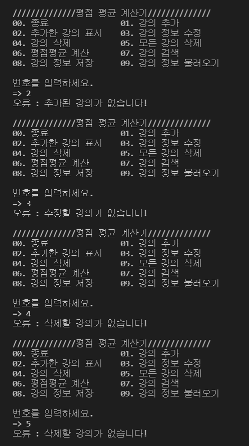

# 목차
1. [강의 추가하기](##1번.-강의-추가하기)
2. [추가한 강의 보기](##2번.-추가한-강의-보기)
3. [강의 정보 수정하기](##3번.-강의-정보-수정하기)
4. [강의 삭제하기](##4번.-강의-삭제하기)
5. [모든 강의 삭제하기](##5번.-모든-강의-삭제하기)
6. [오류 메시지가 뜨는 경우](##오류-메시지가-뜨는-경우)
7. [프로그램 종료하기](##6번.-프로그램-종료하기)
---

## **1번. 강의 추가하기**

군복학생인 나한동은 이번 학기 평점평균을 계산하려고 합니다.   
평균 계산을 위해서는 먼저 수강한 강의를 추가해야합니다.    
`01. 강의 추가`를 선택하게 되면 아래 4가지의 추가 정보를 입력하게 됩니다.

### **1. 전공/교양 선택**
  - 추가할 강의가 전공(1)인지 교양(2)인지 선택합니다.

### **2. 강의 이름 입력**
- 추가할 강의의 이름을 입력합니다.

### **3. 학점 입력**
- 추가할 강의의 학점을 입력합니다.

### **4. 성적(평점) 입력**
- 추가할 강의의 평점을 입력합니다.
- 평점은 `A+, A0, B+, B0, C+, C0, D+, D0, F` 중 하나를 입력합니다.
- `P/F` 과목은 고려하지 않습니다.
---

## **2번. 추가한 강의 보기**

나한동은 `오픈소스(소프트웨어 실습)` 과목과 `스페인어` 과목을 추가했고 강의 정보가 제대로 입력되었는지 확인하고 싶어합니다.    
`02. 추가한 강의 표시` 메뉴를 통해 추가한 강의 정보를 표 형식으로 확인할 수 있습니다.

---
## **3번. 강의 정보 수정하기**

강의 추가에 익숙해졌는지 그새 `논리설계` 과목을 추가했습니다.   
그런데 강의 종류를 교양으로 잘못 입력했네요.   
`03. 강의 정보 수정`을 통해 강의 정보를 수정해보겠습니다.   
강의 정보를 수정하기 위해서 크게 2가지를 입력해야 합니다.

먼저 수정할 강의에 해당하는 번호를 입력합니다.
- `논리설계`에 해당하는 번호는 3번이므로 3번을 입력합니다.

그 다음으로 어떤 정보를 수정할 건지 입력받습니다.
1. 강의 종류
2. 강의명
3. 강의 학점
4. 강의 성적(평점)

수정 이후에도 수정 메뉴를 종료할 때까지 수정할 정보를 계속 선택할 수 있습니다.   
- 수정 메뉴를 종료하면  `02. 추가한 강의 표시` 메뉴를 통해 수정된 강의 정보를 확인할 수 있습니다.

`논리설계` 강의 종류를 `교양`에서 `전공`으로 성공적으로 수정했습니다.

---
## **4번. 강의 삭제하기**

나한동은 갑자기 교양 과목은 평균 계산에 필요 없다며 `스페인어` 강의 정보를 삭제하고 싶어합니다.   
`04. 강의 삭제` 메뉴에서 삭제할 강의에 해당하는 번호를 입력하면 삭제할 수 있습니다.

---
## **5번. 모든 강의 삭제하기**

변덕스러운 나한동은 추가한 모든 강의를 삭제하고자 합니다.   
`05. 모든 강의 삭제`를 통해 모든 강의를 삭제할 수 있습니다.

---
## **6번. 평점 계산하기**

나한동은 자신의 성적이 어떤지 계산을 해보려고 합니다.   
`06. 평점평균 계산`을 통해 전공 평점평균, 교양 평점평균, 백분위 환산점수를 확인할 수 있습니다.

### **1. 원하는 결과 선택**
  - **전공 평점평균**, **교양 평점평균**, **백분위 환산 점수** 중 원하는 결과를 선택합니다. 
  - 포함하고자 하는 결과에 1을 입력합니다.

### **2. 결과 출력**
  - `전체 평점평균`은 항상 출력됩니다.
  - `전공 평점평균`은 모든 전공 과목의 평점의 합을 신청한 전공 학점으로 나눈 값입니다.
  - `교양 평점평균`은 모든 교양 과목의 평점의 합을 신청한 교양 학점으로 나눈 값입니다.
  - `백분위 환산점수`는 전체 평점평균을 0~100 사이의 점수로 환산한 값입니다.
  - 모든 결과는 소숫점 두 자리 수까지 반올림됩니다.

---

## **0번. 프로그램 종료하기**

프로그램을 종료하고 싶을 경우 `0번`을 입력하면 정상적으로 프로그램을 종료합니다.

---
## **오류 메시지가 뜨는 경우**

크게 다음과 같은 경우에서 프로그램은 오류 메시지를 출력합니다.

### 1. 추가한 강의가 없는데 강의 목록을 확인하려는 경우
### 2. 추가한 강의가 없는데 강의 목록을 수정하려는 경우
### 3. 추가한 강의가 없는데 강의 목록을 삭제하려는 경우
